<div align="center">


<br/><br/>

```
 ██████╗ ███╗   ███╗███╗   ██╗██╗
██╔═══██╗████╗ ████║████╗  ██║██║
██║   ██║██╔████╔██║██╔██╗ ██║██║
██║   ██║██║╚██╔╝██║██║╚██╗██║██║
╚██████╔╝██║ ╚═╝ ██║██║ ╚████║██║
 ╚═════╝ ╚═╝     ╚═╝╚═╝  ╚═══╝╚═╝
```

### *A Next-Generation AI Assistant — Context-Aware. Domain-Adaptive. Predictively Intelligent.*

> **"Understand everything. Forget nothing. Simulate before you act."**

<br/>

[🚀 Live Demo](https://drive.google.com/drive/folders/1PIg69rjF-MnUC-JSNNcDp0YgIh59ab4B?usp=sharing) • [📸 Screenshots](#-screenshots) • [⚙️ Installation](#-installation) • [🗺️ Architecture](#-system-architecture)

</div>

---

## 📌 Table of Contents

- [Problem Statement](#-problem-statement)
- [How Omni Solves It](#-how-omni-solves-it)
- [Core Innovations](#-core-innovations)
- [Domain Coverage](#-domain-coverage)
- [System Architecture](#-system-architecture)
- [Workflow Diagrams](#-workflow-diagrams)
  - [High-Level Flow](#1-high-level-system-flow)
  - [Context Understanding Pipeline](#2-context-understanding-pipeline)
  - [Multi-Agent Simulation Flow](#3-praxis-swarm--multi-agent-simulation-flow)
  - [Risk Scoring Logic](#4-risk-score-aggregation-logic)
  - [Domain Adaptation Flow](#5-domain-adaptation-flow)
  - [End-to-End User Journey](#6-end-to-end-user-journey)
- [Google AI Integration](#-google-ai-integration)
- [Tech Stack](#-tech-stack)
- [Installation](#-installation)
- [API Reference](#-api-reference)
- [Project Structure](#-project-structure)
- [Roadmap](#-roadmap)

---

## 🎯 Problem Statement

> **Category: Problem Statement 4 — Next-Generation AI Assistants**

The demand for intelligent systems capable of assisting users in **decision-making**, **automating workflows**, and **managing information** is rapidly increasing across domains. Existing systems often lack **contextual understanding** and **adaptability**.

The challenge: develop an advanced AI assistant capable of:

| Capability | What It Means in Practice |
|---|---|
| 🧠 **Understanding Context** | Go beyond keywords — grasp intent, history, and conversational nuance |
| 🔍 **Analyzing Information** | Process unstructured inputs and extract actionable signals |
| ⚙️ **Performing Meaningful Actions** | Not just answer — actually do things intelligently |
| 🔄 **Adaptability Across Domains** | Work equally well in education, business, and everyday life |
| 📈 **Enhancing Productivity & UX** | Eliminate friction and cognitive overhead for every type of user |

Existing AI assistants fail because they are **reactive, stateless, and single-domain** — they respond to prompts but never truly *understand* the evolving context of a user's world.

---

## 💡 How Omni Solves It

Project Omni is a **Cognitive AI Operating System** — not just a chatbot. It addresses every gap in current next-generation AI assistant systems:

```
❌ Current AI Assistants            ✅ Project Omni
────────────────────────────────    ──────────────────────────────────────────────
Reactive (waits for prompts)    →   Proactive (intercepts + structures context)
Stateless (forgets history)     →   Persistent Ledger (zero information loss)
Single domain (chat only)       →   Multi-domain (business · education · personal)
Generic responses               →   Domain-adaptive personas & expert simulation
No simulation or foresight      →   Praxis Swarm (tests decisions before execution)
Text output only                →   Executable JSON + real-world webhook actions
No risk awareness               →   Quantified Risk Score per decision (0–100)
```

---

## ⚡ Core Innovations

### 🎙️ Innovation 1 — The Cognitive Dashcam *(Context Engine)*

Most AI assistants process what you *say*, not what you *mean*. The Cognitive Dashcam is an **active context intelligence layer** that transforms chaotic, unstructured inputs — voice recordings, lecture notes, casual conversation, meeting transcripts — into a machine-executable ledger of decisions and actions.

**Capabilities:**
- Actively filters noise, filler words, and off-topic tangents from any input
- Identifies intent, ownership, priorities, and deadlines with precision
- Outputs strict **Pydantic-validated JSON** — not summaries, but executable action objects
- Fully domain-adaptive: a student's study plan, a manager's task list, a user's daily agenda all flow through the same pipeline

### 🧪 Innovation 2 — The Praxis Swarm *(Predictive Simulation Arena)*

Before any decision or action is executed, Omni intercepts it. The Praxis Swarm **instantiates specialized AI expert personas** that concurrently debate the proposed action from distinct domain lenses — surfacing hidden risks and generating safer alternatives *before* real-world impact.

**Capabilities:**
- Spawns domain-appropriate AI personas concurrently (e.g. Legal · Finance · Customer for business; Teacher · Student · Parent for education)
- Each persona independently stress-tests the action from its area of expertise
- Aggregates all debate outputs into a quantified **Risk Score (0–100)**
- Auto-generates safer, optimized **alternative action paths**
- Transforms reactive damage control into true **predictive intelligence**

---

## 🌐 Domain Coverage

Project Omni's architecture is domain-agnostic. The same core Gemini-powered engine dynamically shifts behavior based on detected context:

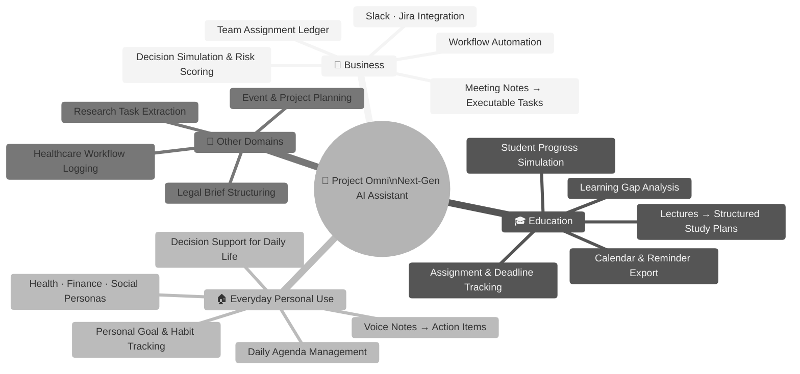

---

## 🏛️ System Architecture

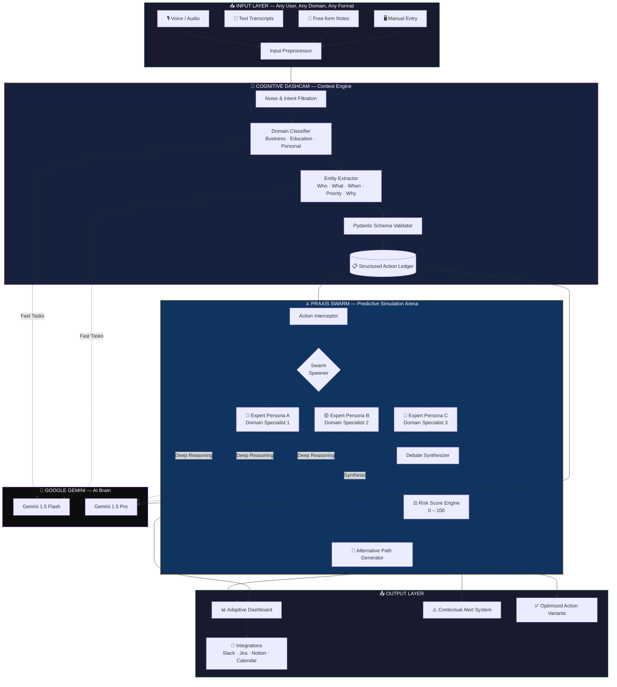

---

## 🗺️ Workflow Diagrams

### 1. High-Level System Flow

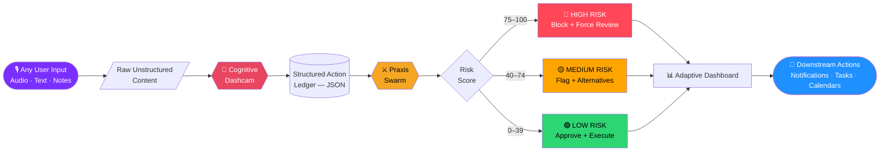

---

### 2. Context Understanding Pipeline

> *How Omni transforms chaotic, unstructured input from any domain into clean, machine-executable context.*

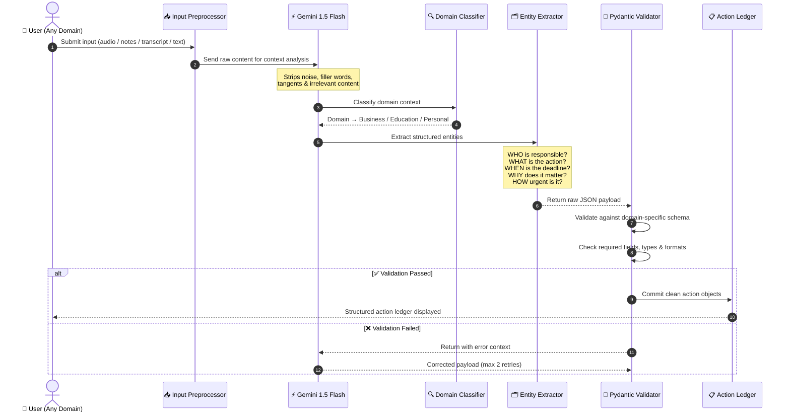

---

### 3. Praxis Swarm — Multi-Agent Simulation Flow

> *How Omni stress-tests every decision before it touches the real world, using concurrent AI expert personas tailored to the detected domain.*

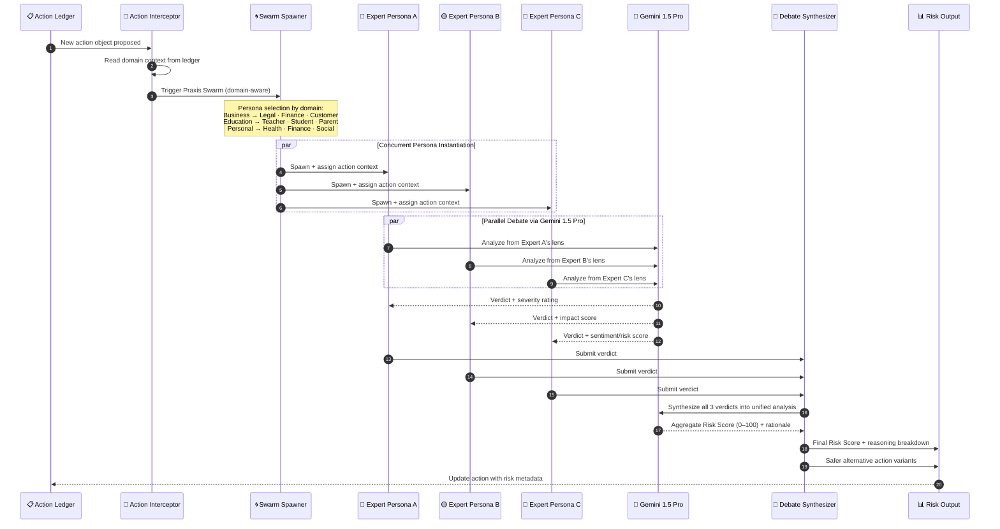

---

### 4. Risk Score Aggregation Logic

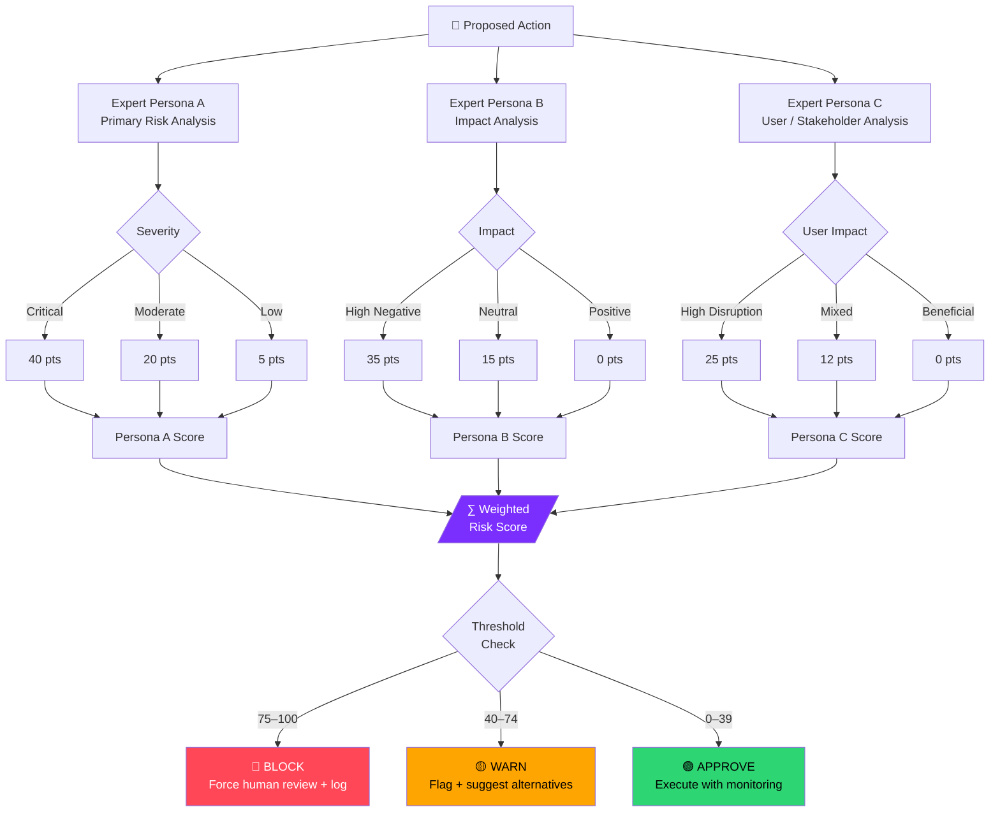

---

### 5. Domain Adaptation Flow

> *How the same Omni core engine shifts its persona, schema, and output format based on who the user is and what they're doing.*

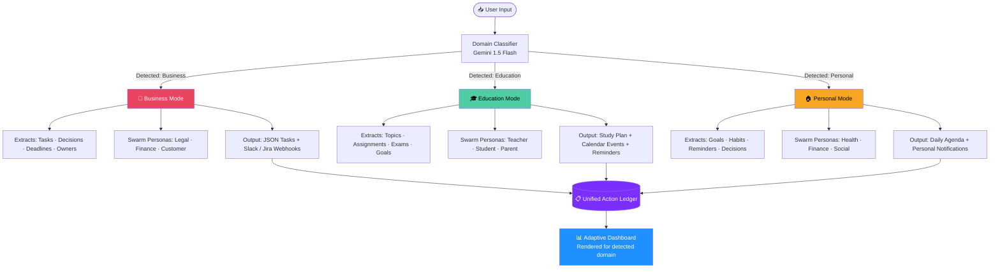

---

### 6. End-to-End User Journey

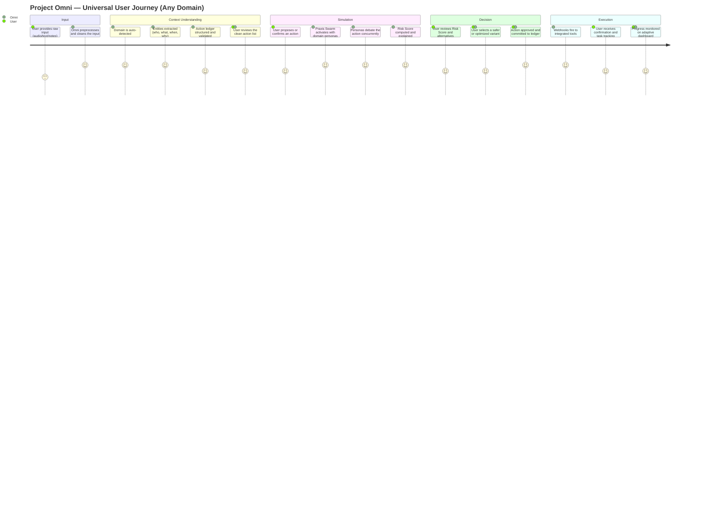

---

## 🤖 Google AI Integration

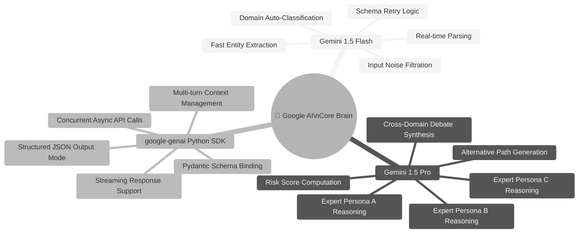

| Model | Role | Why This Model |
|---|---|---|
| **Gemini 1.5 Flash** | Input parsing, domain detection, entity extraction | Low-latency; ideal for high-frequency preprocessing tasks |
| **Gemini 1.5 Pro** | Multi-agent persona debates, synthesis, risk scoring | Maximum reasoning depth for critical simulation accuracy |

---

## 🛠️ Tech Stack

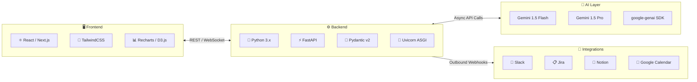

---


## 📦 Installation

### Prerequisites

| Requirement | Version |
|---|---|
| Python | `>= 3.9` |
| Node.js | `>= 18.x` |
| Google AI API Key | [Get one here](https://makersuite.google.com/app/apikey) |

### Setup

```bash
# 1. Clone the repository
git clone <your-repo-link>
cd Project-Omni
```

```bash
# 2. Backend Setup
cd backend
python -m venv venv
source venv/bin/activate        # Linux/macOS
# venv\Scripts\activate         # Windows

pip install -r requirements.txt

cp .env.example .env            # Add your GOOGLE_API_KEY here

python -m uvicorn app.main:app --reload --port 8000
```

```bash
# 3. Frontend Setup (new terminal)
cd frontend
npm install
npm run dev
```

```
✅ Backend  →  http://localhost:8000
✅ Frontend →  http://localhost:3000
✅ API Docs →  http://localhost:8000/docs
```

### Environment Variables

```env
GOOGLE_API_KEY=your_gemini_api_key_here
GEMINI_FLASH_MODEL=gemini-1.5-flash
GEMINI_PRO_MODEL=gemini-1.5-pro
ALLOWED_ORIGINS=http://localhost:3000
DEFAULT_DOMAIN=auto              # auto | business | education | personal
```

---

## 📡 API Reference

| Method | Endpoint | Description |
|---|---|---|
| `POST` | `/api/v1/input/parse` | Submit raw input → returns structured action ledger |
| `GET` | `/api/v1/ledger` | Fetch all structured action objects |
| `GET` | `/api/v1/domain/detect` | Detect domain context from input text |
| `POST` | `/api/v1/actions/simulate` | Trigger Praxis Swarm on a proposed action |
| `GET` | `/api/v1/actions/{id}/risk` | Get full Risk Score + all persona verdicts |
| `PUT` | `/api/v1/actions/{id}/approve` | Approve or reject a simulated action |
| `GET` | `/api/v1/dashboard/summary` | Aggregated dashboard metrics |

---

## 🗂️ Project Structure

```
Project-Omni/
├── 📁 backend/
│   ├── 📁 app/
│   │   ├── main.py                    # FastAPI entrypoint
│   │   ├── 📁 api/
│   │   │   ├── input.py               # Input parsing endpoints
│   │   │   ├── actions.py             # Praxis Swarm endpoints
│   │   │   └── dashboard.py           # Metrics endpoints
│   │   ├── 📁 core/
│   │   │   ├── dashcam.py             # Cognitive Dashcam logic
│   │   │   ├── domain_classifier.py   # Auto domain detection
│   │   │   └── praxis_swarm.py        # Multi-agent simulation engine
│   │   ├── 📁 schemas/
│   │   │   ├── action.py              # Pydantic action models
│   │   │   ├── domain.py              # Domain-specific schemas
│   │   │   └── risk.py                # Risk score models
│   │   └── 📁 services/
│   │       └── gemini.py              # Google AI integration layer
│   └── requirements.txt
│
├── 📁 frontend/
│   ├── 📁 src/
│   │   ├── 📁 components/
│   │   │   ├── ActionLedger.jsx       # Structured task view
│   │   │   ├── SwarmDebate.jsx        # Live debate visualizer
│   │   │   ├── RiskGauge.jsx          # Risk score component
│   │   │   └── DomainBadge.jsx        # Active domain indicator
│   │   ├── 📁 pages/
│   │   │   ├── Dashboard.jsx
│   │   │   └── Simulate.jsx
│   │   └── App.jsx
│   └── package.json
│
├── 📁 proof/
│   ├── screenshot1.png
│   └── screenshot2.png
│
└── README.md
```

---

## 🔭 Roadmap

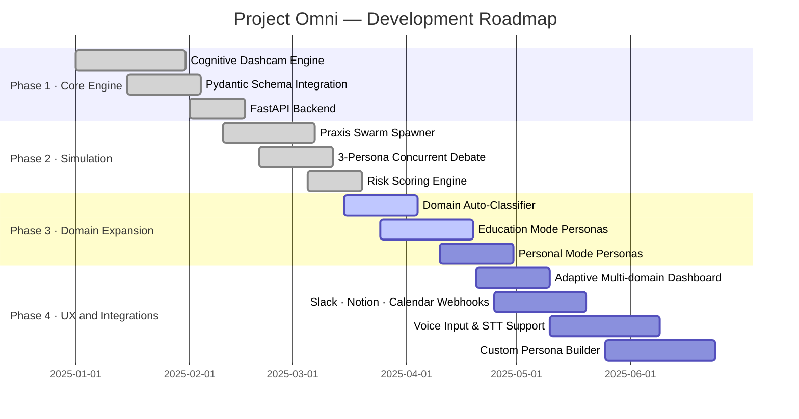

---

## 🤝 Contributing

```
1. Fork the repository
2. Create your feature branch:   git checkout -b feature/AmazingFeature
3. Commit your changes:          git commit -m 'feat: Add AmazingFeature'
4. Push to the branch:           git push origin feature/AmazingFeature
5. Open a Pull Request
```

---

## 📄 License

This project is licensed under the **MIT License** — see the [LICENSE](LICENSE) file for details.

---

<div align="center">

**Built with ❤️ using Google Gemini AI**

*Context-aware. Domain-adaptive. Predictively intelligent.*
*A true next-generation AI assistant for education, business, and everyday life.*

⭐ **Star this repo** if Project Omni changed the way you think about AI assistants!

</div>
