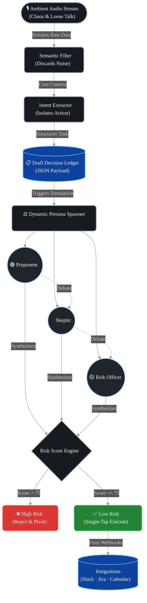

<div align="center">


<br/><br/>

```
 ██████╗ ███╗   ███╗███╗   ██╗██╗
██╔═══██╗████╗ ████║████╗  ██║██║
██║   ██║██╔████╔██║██╔██╗ ██║██║
██║   ██║██║╚██╔╝██║██║╚██╗██║██║
╚██████╔╝██║ ╚═╝ ██║██║ ╚████║██║
 ╚═════╝ ╚═╝     ╚═╝╚═╝  ╚═══╝╚═╝
```

### *The Cognitive OS for Decision Makers.*

> **"Listen ambiently. Simulate the real world. Bridge the Say-Do Gap."**

<br/>

[🚀 Live Demo](https://drive.google.com/drive/folders/1PIg69rjF-MnUC-JSNNcDp0YgIh59ab4B?usp=sharing) • [📸 Screenshots](#-screenshots) • [⚙️ Installation](#-installation) • [🗺️ Architecture](#-system-architecture)

</div>

---

## 🎯 Problem Statement

> **Category: Problem Statement 4 — Next-Generation AI Assistants**

Decision-makers face two massive bottlenecks:

1. **The Input Friction:** Having to constantly stop and type prompts into an AI to get things done.
2. **The Say-Do Gap:** The massive chasm between a great idea proposed in a meeting, and the messy, risk-filled reality of executing it in the real world.

Current AI assistants just agree with whatever you tell them to do. They do not test the resilience of a decision, and they don't anticipate the real-world pushback you will inevitably face from stakeholders, clients, or the market.

**The Challenge:** Build a next-generation assistant that seamlessly captures decisions directly from ambient environments, and then **simulates the execution** of those decisions in a virtual real-world setting to expose risks *before* taking action.

---

## 💡 Project Description

Project Omni is a dual-engine AI Operating System designed specifically for decision-makers. It operates in two phases: **Capture** and **Simulate**.

### Phase 1: The Cognitive Dashcam (Zero-Prompt Capture)

Omni runs quietly in the background of your meetings, brainstorming sessions, or daily life. It actively filters out ambient noise, casual banter, and "loose talk," isolating only the core intent. When the session ends, it has already transformed your thoughts into structured, executable tasks — without you ever typing a single prompt.

### Phase 2: Praxis (The Real-World Simulation Engine)

Before executing any captured task, Omni routes it through **Praxis**. Praxis is not a chatbot; it is a multi-agent simulation arena.

- It takes your proposed decision and spawns multiple AI agents, each assigned a dynamic persona based on the context of the prompt (e.g., a Skeptical Client, a Risk-Averse Legal Officer, and a Resource-Constrained Engineer).
- These agents chat, debate, and push back against the decision.
- Their interactions are mathematically weighted by a dynamic **Risk Score** based on the resources and constraints of the situation.
- **The Goal:** To definitively close the **Say-Do Gap** by predicting exactly where your execution will fail, and providing a hardened, risk-adjusted path forward.

---

## 🏛️ System Architecture



---

## 🤖 Google AI Usage

### Tools / Models Used

| Model | Role |
|---|---|
| **Gemini 1.5 Flash** | Powers the Cognitive Dashcam — fast ambient audio processing, semantic filtering, and structured JSON extraction |
| **Gemini 1.5 Pro** | Drives Praxis — deep reasoning for multi-agent persona simulation, constraint enforcement, and risk scoring |
| **google-genai Python SDK** | Orchestrates the full async workflow with Pydantic schema validation |

### How Google AI Was Used

**Step 1 — Ambient Capture (Gemini Flash):**
The Cognitive Dashcam pipes audio or notes through Gemini 1.5 Flash. Its massive context window handles long sessions in real time, discarding loose talk and extracting structured decisions as JSON.

**Step 2 — Praxis Simulation (Gemini Pro):**
The extracted decision (e.g., *"Let's push the new UI update to production on Friday"*) is immediately routed to Gemini 1.5 Pro. The SDK calls the model with a dynamically generated system prompt that:
- Assigns three competing personas (e.g., *Lead Developer*, *Customer Support Lead*, *Security Officer*)
- Forces them into a structured chat debate using Pydantic output contracts (`SwarmRoles`, `AgentResponse`, `OrchestratorSynthesis`)
- If the "Customer Support Lead" agent flags a Friday release as a historical spike risk, it raises the internal **Risk Score**

**Step 3 — Say-Do Gap Resolution:**
Gemini synthesizes the multi-agent chat log into a final `OrchestratorSynthesis` object containing:
- A numeric `riskScore` (0–100)
- A `riskLevel` label (`low`, `medium`, `high`)
- A one-sentence `sayDoGap` summary
- A `saferVariant` recommendation
- A `insight` behavioral prediction

The result is pushed to Firebase Firestore and surfaces on the frontend dashboard in real time via `onSnapshot`.

---

## 📸 Proof of Google AI Usage

> Screenshots are stored in the `/proof` folder of this repository.

### Screenshot 1 — Praxis Multi-Agent Backend (`simulation_swarm.py`)


This screenshot shows `simulation_swarm.py` open in VS Code within the `Project-Omni` workspace. It directly demonstrates:
- `from google import genai` and `from google.genai import types` imports on lines 4–5, confirming use of the official **google-genai Python SDK**
- **Pydantic output contracts** (`SwarmRoles`, `AgentResponse`, `OrchestratorSynthesis`, `PraxisSimulationResult`) that enforce strict structured JSON responses from Gemini 1.5 Pro
- Field-level descriptions on lines 10–34 showing exactly how the multi-agent personas (Proponent, Skeptic, Risk Officer) and the final `riskScore`/`sayDoGap` analysis are defined and captured
- The project file tree on the left confirms the full stack: `ai/`, `backend/app/`, and `frontend/src/` directories are all present and active

### Screenshot 2 — Architecture & Real-Time Sync Planning with Gemini


This screenshot shows a **live Gemini conversation** (at `gemini.google.com`) titled *"Backend Development Plan Explained"* in which Gemini was used as the technical co-architect for Project Omni. Key evidence:
- **Phase 3: Integration & Real-Time Sync (Hours 24–36)** — Gemini explicitly details the Firebase `onSnapshot` pattern used to wire the Praxis simulation output to the live frontend dashboard
- Gemini explains the `db.collection().add()` flow that causes new cards to *"automatically pop up with new cards without the user refreshing"* — this is the exact mechanism implemented in the final product
- **The Demo Loop** section shows Gemini advising on how to pre-populate the database with demo transcripts, confirming it shaped the project's demo strategy
- The chat history on the left sidebar reveals an extended, multi-session AI collaboration: *"AI Assistant for Enterprise Decision-..."*, *"AI Farming: WOW Factors & Loopholes"*, and more, demonstrating sustained use of Google AI throughout development

### Screenshot 3 — Live Firebase Cloud Infrastructure (`project-omni-fbc7f`)


This screenshot shows the **Firebase Console** logged in as *Adithya*, proving active cloud infrastructure deployment:
- The project `Project-Omni` with ID `project-omni-fbc7f` is listed as the sole active project under the account
- This is the live Firestore database that receives real-time simulation results from the Gemini-powered Praxis backend and streams them to the frontend via `onSnapshot`
- The console confirms the infrastructure is not mocked — it is a real, deployed Firebase project backing the live demo

---

## 🎥 Demo Video

[▶ Watch the Project Omni Demo](https://drive.google.com/drive/folders/1PIg69rjF-MnUC-JSNNcDp0YgIh59ab4B?usp=sharing) *(Max 3 minutes)*

---

## ⚙️ Installation

### Prerequisites

- Python `>= 3.9`
- Node.js `>= 18.x`
- [Google Gemini API Key](https://aistudio.google.com/app/apikey)

### Setup Instructions

```bash
# 1. Clone the repository
git clone <your-repo-link>

# 2. Go to project folder
cd project-name

# 3. Backend Setup (Cognitive Dashcam API)
cd backend
python -m venv venv
source venv/bin/activate  # On Windows: venv\Scripts\activate
pip install -r requirements.txt

# Create environment file and add your Gemini API Key
cp .env.example .env
# Edit .env and add: GOOGLE_API_KEY=your_key_here

# Start the FastAPI server
python -m uvicorn app.main:app --reload --port 8000
```

```bash
# 4. Frontend Setup (Zero-Prompt Dashboard)
cd ../frontend
npm install

# 5. Run the client
npm run dev
```

The dashboard will be available at `http://localhost:5173`.

---

## 📄 License

This project is licensed under the **MIT License**.
